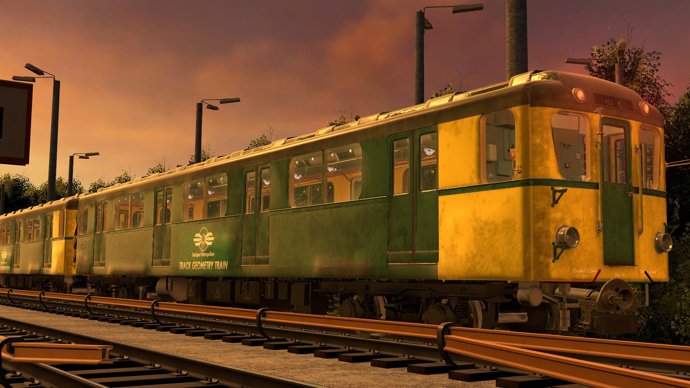
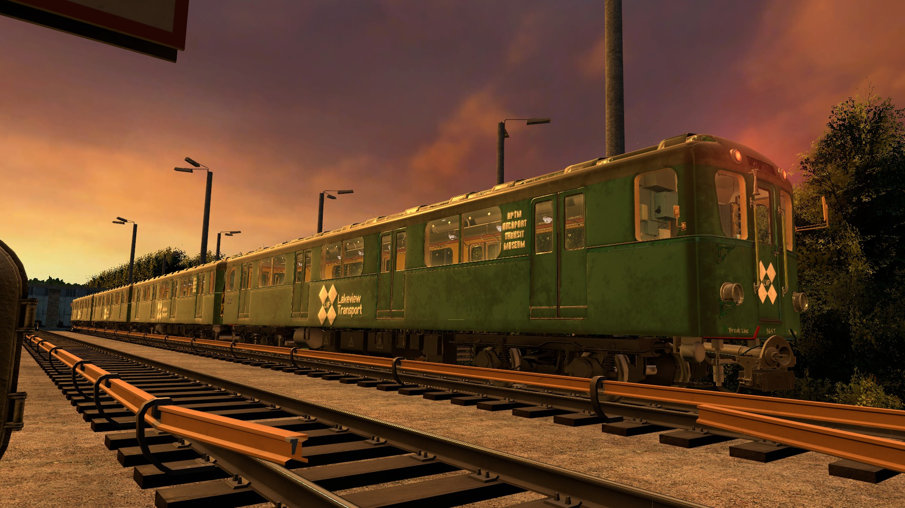
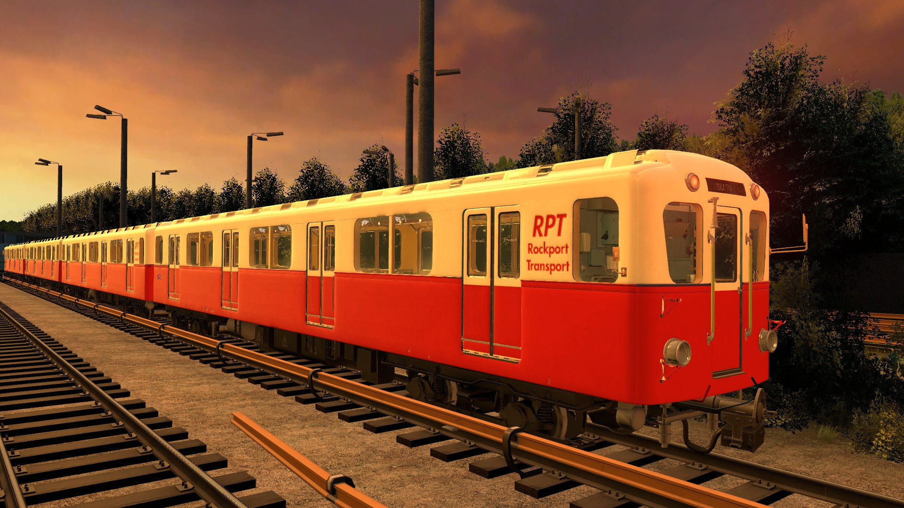
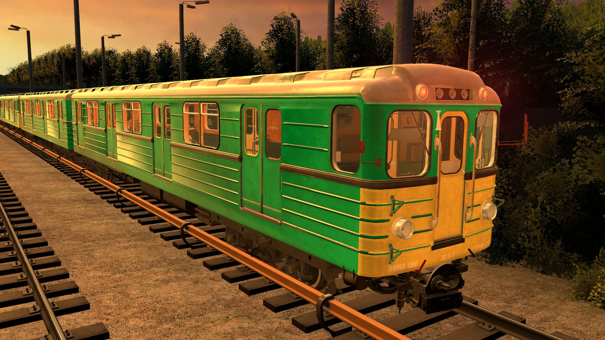
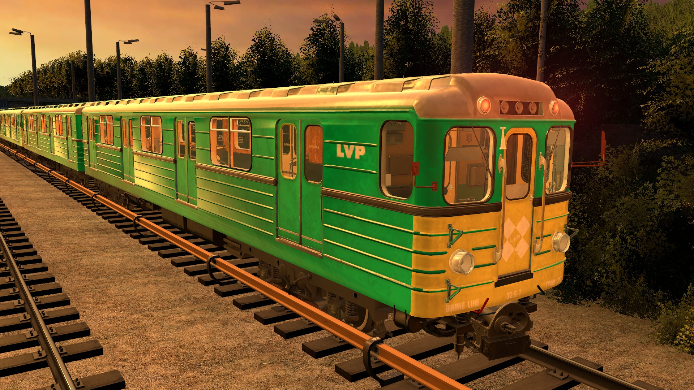
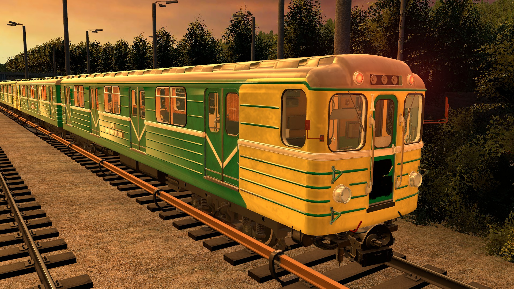
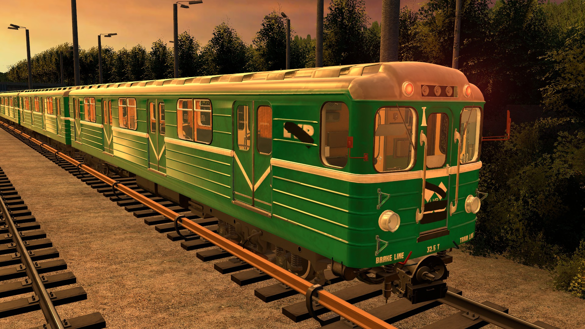
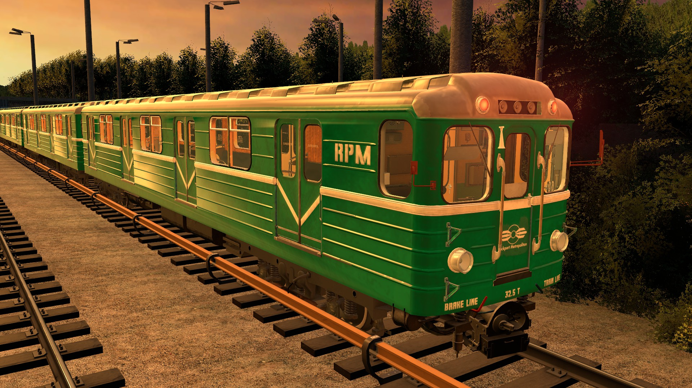
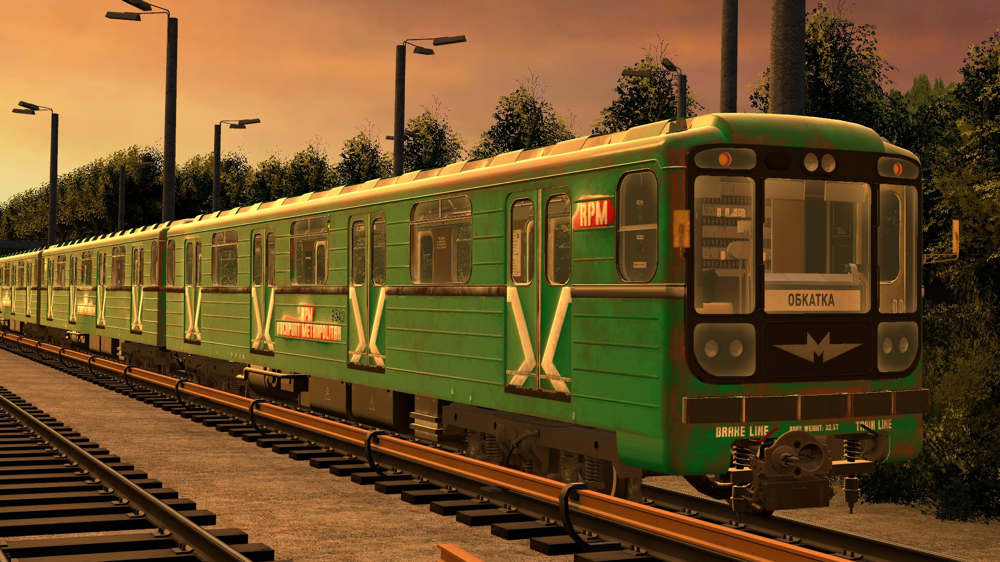
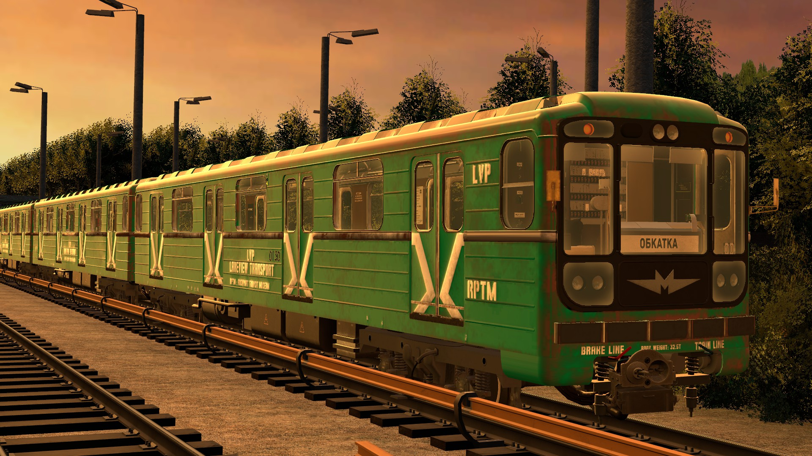

# Skin pack Development

This branch used as development,  so all WIP stuff come here.
When development stuff is done and checks are fine, then pull request can be done to merge this with Main branch.

## Versions 
* Dev build updates: *OV1*
* Current update on MEU: *Beta 1.5*
* Workshop version: *no number, Old update*
> Future Workshop update: Release 1: Overhaul 2 update

## Current skins & Variations
- 81-702 / 81-701 (D Type)

| Lakeview Transport livery | Track Geometry train (Ex: LVP) |
| --- | ----- |
|  |  | 
| Clean Livery without any company logos, This was before LVP & RPM started to work together in 1974. | 1991 Livery when RPM owns the line and has started to use old LVP stock as work trains.

| Ex Lakeview Transport (Retired) | Rockport museum livery : LVP
| -- | -- |
|  | 
| 1986 Livery when LVP went bankrupt, Livery shows lack of care for the older trains in 1980 to 1985. | Museum livery what was shown in 2003 on Transport day.

| Rockport Transport (1930) 
| -- |
| 
|1930's Livery of Rockport Metropolitants precursor company Rockport Transport. Only D types were under RPT before RPM became operator of whole city's transport.

- E types (not Ema)

| Lakeview Transport Livery | Lakeview Transport Duck Livery |
| --- | ----- |
|  |  | 
| LVP livery without any logos. | Duck livery of LVP, Used on lines what were street running, Most of these lines closed in 1970 - 1980.

| Lakeview Transport Duck logo Livery | Lakeview Transport Livery 1980s |
| --- | ----- |
|  |  | 
| Same as other duck livery but with Logos. | Refreshed livery from 1980s.

| Track Geometry train (ex: LVP) | Retired LVP train. |
| --- | ----- |
|  |  | 
| Track Geometry train. | Retired train.

| Rockport Museum Livery : LVP | Rockport metropolitan livery |
| --- | ----- |
|  |  | 
| Museum Livery. | Livery from time when RPM started to operate the line, Most of LVP stock stayed on the line until their retirement.

- 81-717

| Lakeview Transport Livery | Rockport metropolitan livery |
| --- | ----- |
|  |  | 
| LVP livery | Livery from time when RPM started to operate the line, Most of LVP stock stayed on the line until their retirement.

| Rockport Metropolitan Museum | - |
| --- | ----- |
|  | - | 
| Museum Livery. | -

## Skins TODO-list
This list is in-general todo-list of skins what will be coming, Release dates are fully random due skin making does take time.
* First 1 ~ 3 versions only bring Brand new textures for the trains.
    * Later LVP & RPM trains are meant to get different condition liveries.
    * E Types only get Exterior and Cab stuff changes, Wall texture in the cabs will be selected from Delsin's texture pack. Saloons will stay free to change by player.
### Release 1 trains & skin variations.
| Train Type | RPM Skin | LVP Skin | Notes |
| :-------:   | :-----:   | :----: | -------- |
| 81-702 | No* | Yes | Only Exterior & Cab textures, Saloon uses Default skin.
| 81-703 | Yes | Yes | -
| 81-707 | Yes | Yes | -
| 81-710 | Yes | Yes | -
| Ezh3ru1 | Yes | Yes | - 
| 81-502 | Yes | No | LVP never ordered 81-502's, they had some 81-705s but never painted to LVP livery.
> * 81-702 has RPT skin.

### Release 2 trains & skin variations.
| Train Type | RPM Skin | LVP Skin | Notes |
| :-------:   | :-----:   | :----: | -------- |
| 81-717 | Yes | Yes* | The last LVP skin, Lore: there were very few of 717's ever bought due LVP's bankrupt in 1995 Adds variant with LVP logo replaced with RPM logo.
| 81-718 | Yes | No | -
| 81-720 | Yes | No | -
| 81-722 | Yes | No | -
| 81-740 | Yes | Maybe? | LVP skin would be more a test skin
> * 81-717 LVP livery is released on Release 1 w/o any RPM interiors or cab changes..

### Release 3
> Plans might change later, This is not final.
| Train Type | Operator skin (LVP, RPM, RPT) | Skin Variation | Notes |
| :-------:   | :-----:   | :----: | -------- |
